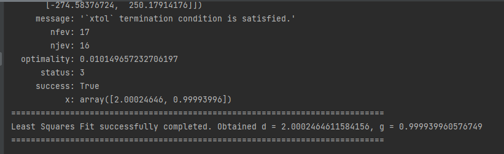
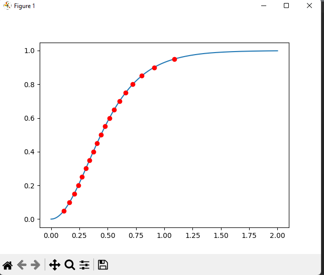

# SIGMOID toolkit

В настоящата директория се съдържат няколко скрипта, чиято цел е да са полезни при изследването на разглежданите сигмоидни криви.

Най-последната версия на скрипта винаги ще се намира в [GitHub](https://github.com/vasilvas99/sigmoid-tools)

## Installation

### pip

Тези скриптове използват малък набор от библиотеки за числени пресмятания, които е необходимо да се инсталират през python модула pip.

За да се сдобиете с него:

``` 
https://pip.pypa.io/en/stable/installation/
```

### Requirements 

След като има функционален pip, в главната директория със скриптовете ще намерите файл `requirements.txt`.
За да инсталирате всички необходими библиотеки отворете терминал в тази директория и изпълнете: 


```bash
pip3 install -r ./requirements.txt
```

Изчакайте инсталацията да завърши. След това всичко трябва да е готово за работа.

## Configuration

Към тези скриптове има единствен конфигурационен файл `config.json`, който винаги трябва да присъства в същата директория като тях. Той трябва да съдържа подобна структура:

```json
{
  "t0": 0.0,
  "t_final": 1.2,
  "initial_alpha": 1e-14,
  "n_terms_taylor": 1,
  "csv_delimiter": "\t",
  "param_finder_props": {
    "d_min": 0,
    "g_min": 0.5,
    "mu_min": 0.0,

    "d_max": 3,
    "g_max": 2.5,
    "mu_max": 2,

    "g_ini": 1,
    "d_ini": 2,
    "mu_ini": 0.5,

    "shift_time": 0

  }
}
```

`t0` и `t_final` задават интервала от време, в който всички числени методи работят (в частност РК8 интегрира ОДУ).

`initial_alpha` задава началната стойност на алфа. Тъй като 0 е устойчива равновесна точка (не-глобално), ние искаме траектории, сходящи към 1, но започващи от 0. За целта избираме стойност много близо до 0, напр. $10^{-14}$.

`csv_delimiter` задава символа (по подрабиране "таб"), който разделя колоните във входния файл за `parameter_finder.py`.


## Scripts

### Parameter finder

Това е оптимизационният скрипт, който намира по метода на нелинейните най-малки квадрати. Той изисква минимално "включване" от страна на потребителя. 

За използване:

```bash
python parameter_finder <path_to_input_file.csv>
```

Където `parameter_finder` пътя до файла с входните данни. Примерен такъв e ./misc/test_input_D2g1.txt. Съдържанието на подобен файл трябва да е като следното:

```
0	0
0.113724768	0.05
0.163725075	0.1
0.204308838	0.15
0.240605913	0.2
0.274653072	0.25
0.307561002	0.3
0.340068135	0.35
0.372749077	0.4
0.40611663	0.45
0.440686794	0.5
0.477034738	0.55
0.515859267	0.6
0.558075262	0.65
0.604967561	0.7
0.658478948	0.75
0.721817738	0.8
0.800951301	0.85
0.90922323	0.9
1.089136105	0.95
```

Където първата колонка са стойностите на обезразмереното време, а втората - стойностите на степента на превръщане.

Успешна оптмизация би изглеждала по-следния начин:




Т.е. скрипта ще изпише в конзолата стойностите за d, g > 0 и ще изрисува графиката на съответстваща на тези стойности сигмоида и входните данни (червени точки).


 

